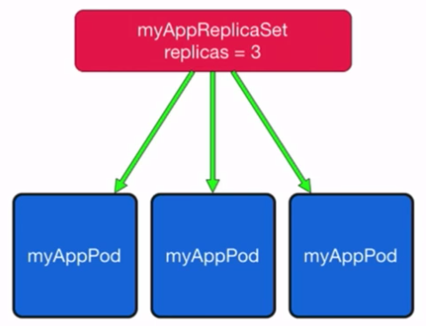
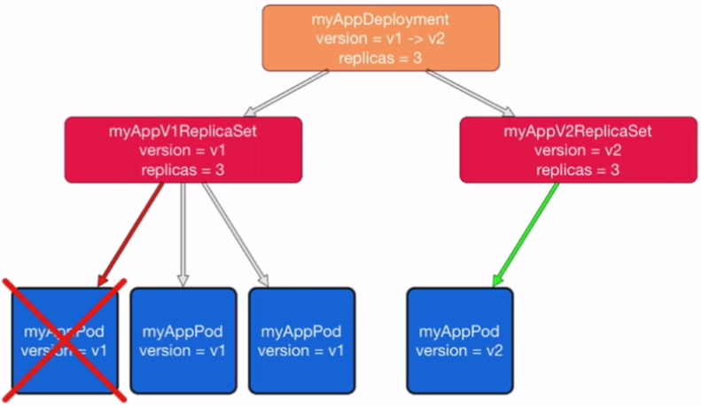
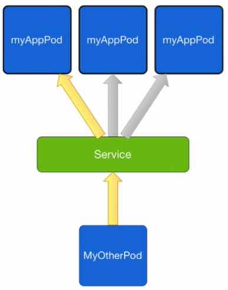
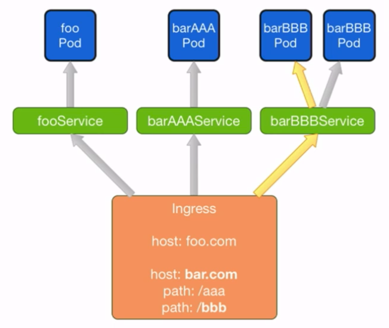

# Concepts

## 1. Pods

* smallest deployment unit
* small group fo tightly coupled containers
* shared network and data volumes 
* routable IP address
* mortal

## 2. ReplicaSets

* run x copies(replicas) of a pod
* start or kill pods if necessary
* handle pod failures
  * health checks
* ReplicaSets is created by deployments
 

## 3. Deployments

* constains declaraion of your application
  * which containers (image/tag)
  * environment variables
  * data volumes
* define number of replicas
* creates ReplicaSets, which in turn create Pods
* rolling updates

## 4. Services 

* pods are mortal
* services provide a permanent virtual IP and DNS name
* proxy traffic to selected pods
* simple load balancing include session affinity

## 5. Ingress

* expose services to the outside world
* map URLs to services
* SSL termination
* needs ingress provider

## 6. Namespaces

* Namespaces group kubernetes resources (pods, replicasets, deployments, ...)
* by default everything is in the 'default' namespace
* create namespaces for your environments (e.g. test, staging, production) and / or tenants
* restrict access to specific namespace for k8s users
* namespaces can have separated networks( depends on network provider)

## 7. Clusters

* a cluster is a set of virtual or physical machines (nodes), running a k8s master and one or more k8s worker nodes
* cluster federation:
  * run a federation master, which knows all your clusters
  * run your apps distributed across cluster, e.g. across Amazon / Google / ... regions
  
## 8. Secrets and ConfigMaps

* separate your application code (=images) and configuration
* both Secrets and ConfigMaps are key-value-pairs 
* use Secrets for binary values (e.g. certifications, keys)
* use ConfigMaps for string values
* both can be read by the container via environment variables or mapped into a data volume e.g. like property files

## 9. Data Volumes

* map directories into containers
* multiple containers in one pod share the same volumes
* many volumes type:
  * empty directory
  * host directory
  * Google Persistent Disk
  * Amazon Blob Store
  * NFS
  * glusterfs
  * rdb
  * cephs
  * git repository
* can be preconfigured by cluster admins for easier usage by cluster users

## 10. PetSets

* a Pet is a stateful pod
* a PetSet has a scalable number of Pets
* a Pet is bound to a dynamically created data volume
* that data volume will never be deleted automatically
* the Pet is bound to the same volume on a restart 

## 11. Jobs

* sometimes you need to run short living tasks
* a Job ensures that a container which executes such a task runs successfully exactly once (or more times)
* retry on failure
* Scheduled Jobs can be started at specific times (line cron)

## 12. DaemonSets

* DaemonSets run pods on all ( or a selected set of ) nodes in the cluster
* useful for running containers for logging and monitoring

## 13. Autoscalling

* Horizontal Pod Autoscalling
  * scales ReplicaSets based on pod's CPU usage or app-provided metrics
  
* Cluster Autoscaling
  * scale the number of nodes in your cluster based on CPU and memory usage
  * depends on cloud provider 

## 14. API

* every functionality is provided via a REST API
* easy integration in your existing workflows (continuous delivery)
* command line tool 'kubectl' (use the REST API internally)

